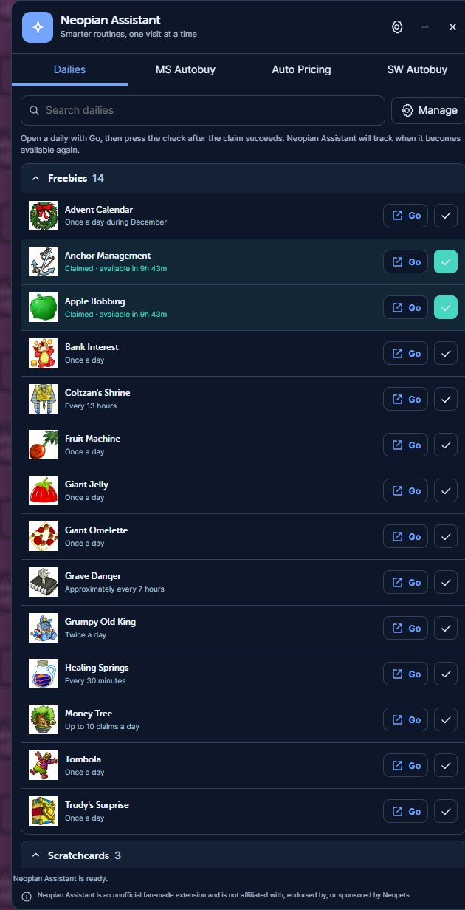
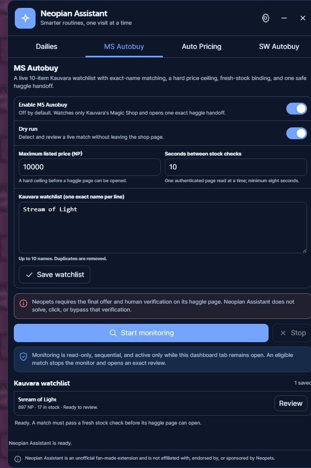

# Neopian Assistant

**Neopian Assistant — Dailies, Pricing & Shop Tools**

_Your all-in-one companion for smarter Neopets routines._

Neopian Assistant is a Manifest V3 Chrome extension for organizing Neopets routines, comparing shop
prices, monitoring bounded Shop Wizard and Kauvara watchlists, and handling tightly limited one-item
shop workflows. The dashboard is built with vanilla JavaScript, HTML, and CSS and runs only on the
audited `https://www.neopets.com/*` origin.

> Neopian Assistant is an unofficial fan-made extension and is not affiliated with, endorsed by, or
> sponsored by Neopets.

Current extension version: **7.13.0**

Manifest version: **3**

Minimum Chrome version: **114**

## What the extension does

| Mode       | Feature                      | What happens                                                                                   | Can change account state?              |
| ---------- | ---------------------------- | ---------------------------------------------------------------------------------------------- | -------------------------------------- |
| Navigation | Dailies **Go** links         | Opens the selected official Neopets page.                                                      | No                                     |
| Tracking   | Manual claim cooldown        | Stores a local claim time only after the user presses the separate check control.              | Extension data only                    |
| Assistance | Shop Wizard price scan       | Reads validated prices at a conservative interval and prepares suggestions.                    | No                                     |
| Automation | Reviewed Auto Pricing update | Sends one exact shop-price form after fresh-state validation and explicit confirmation.        | Yes—changes shop prices                |
| Assistance | MS Autobuy live watchlist    | Monitors up to 100 exact names in Kauvara's Magic Shop while its dashboard tab is open.        | No                                     |
| Assistance | MS Autobuy dry run           | Detects, fresh-checks, and reviews one Kauvara listing without opening its purchase flow.      | No                                     |
| Automation | One-item MS Autobuy          | After user verification, submits the exact listed price once and verifies the result.          | Yes—spends Neopoints and adds one item |
| Assistance | SW Autobuy live watchlist    | Sequentially monitors up to 10 exact Shop Wizard names while its dashboard tab is open.        | No                                     |
| Assistance | SW Autobuy dry run           | Validates and reviews one Shop Wizard listing without following the purchase URL.              | No                                     |
| Automation | Reviewed one-item SW Autobuy | Rechecks and follows one exact listing URL once, below a configured maximum, then verifies it. | Yes—spends Neopoints and adds one item |

No daily is automatically marked claimed. There is no bidding, offering, trading, donating,
discarding, inventory transfer, CAPTCHA handling, stealth behavior, proxy rotation, credential
access, telemetry, or developer-operated backend.

## Feature guide

### Dashboard

The movable and resizable on-page dashboard provides:

- Light, dark, or system theme.
- Comfortable or compact density.
- Dailies, MS Autobuy, Auto Pricing, and SW Autobuy tabs.
- Searchable and editable daily groups.
- Polite status announcements, keyboard-operable controls, visible focus, and reduced-motion
  support.
- Idempotent initialization and deterministic teardown on page exit.

### Popup

The toolbar popup shows global enablement, the current page type, feature availability, a dashboard
focus action, settings access, the privacy summary, and the exact unofficial disclaimer.

### Settings

The options page controls global appearance, dailies, Auto Pricing, SW Autobuy, dry-run modes,
watchlist names, request pacing, price limits, local export/import, deletion, and redacted operation
history. MS Autobuy's controls live in its exact-page dashboard tab. Imports are schema-validated,
capped at 1 MB, and require confirmation before replacing data.

### Dailies

- Official daily pages are opened only when the user selects **Go**.
- Claim tracking is a separate check action after the destination reports success; navigation never
  implies a claim.
- Claimed routines show a dynamic next-available countdown. Daily and manual/anytime claims use the
  next Neopian `America/Los_Angeles` day boundary, monthly claims use the next Neopian month, and
  elapsed timers use the exact claim timestamp.
- Count-based routines remain ready until their daily limit is reached, then count down to the next
  Neopian reset.
- A claimed routine cannot be clicked again to erase its cooldown. The control becomes available
  naturally when its validated time or reset boundary expires.
- Groups, routines, notes, cooldowns, and approved `www.neopets.com` URLs can be edited locally.
- Official item images from `images.neopets.com` are used under the repository owner's stated
  project-specific approval. The extension logo is original artwork.

### Auto Pricing

Auto Pricing remains available and is hardened around its approved pricing rules.

1. Enable Auto Pricing; dry run remains on by default.
2. Open `https://www.neopets.com/market.phtml?type=your`.
3. Start a price scan. The service worker queries the fixed Shop Wizard endpoint sequentially with a
   6–60 second configured interval.
4. Review each current, lowest, and suggested price.
5. For a real update, disable dry run and explicitly authorize the exact plan.
6. Immediately before submission, the extension fetches fresh shop stock and requires the account
   plus every selected item's ID, name, field names, and current price to match the reviewed plan.
7. A short-lived fingerprint-bound confirmation and cross-tab lock permit one POST containing only
   selected changed rows. Selected rows are reindexed contiguously and carry the live form's row
   count plus prior-price guard; excluded shop rows are neither submitted nor rewritten. There is no
   automatic retry.
8. The extension fetches shop stock again and reports success only if every selected price exactly
   matches.

Prices must be integers from 1 through 999,999 NP for selected updates. Correct comma separators are
accepted; malformed grouping, internal whitespace, negatives, decimals, empty values, and zero sale
prices are rejected. If a submitted request cannot be verified, its status is `uncertain` and the
user is told to reload and inspect stock before any manual retry.

### MS Autobuy

MS Autobuy replaces the former standalone Progress tab. It monitors only Kauvara's Magic Shop and
automates one exact listed-price purchase after the user completes Neopets' official verification.

1. It is off by default and dry-run is on by default.
2. Save up to 100 exact item names and set an 8–60 second interval. MS Autobuy has no user price
   ceiling: live mode uses any valid listed price from 1 through 999,999 NP.
3. Open `https://www.neopets.com/objects.phtml?type=shop&obj_type=2` and select **Start dry-run
   monitoring** or **Start automatic buying**. Monitoring is sequential, cancellable, and active
   only while the MS Autobuy dashboard tab stays open.
4. Every stock read is worker-authorized against the persisted watchlist and exact Kauvara page.
   Cards must have matching visible/data names, matching visible/data prices, positive stock, and an
   exact `haggle.phtml` URL containing only `obj_info_id`, `stock_id`, and `g`.
5. The first eligible exact match stops monitoring. Dry run opens a quantity-one review and ends
   without navigation or a request.
6. Live mode authorizes one additional paced stock read. The same name, object, stock record, price,
   positive stock, and exact URL must still match within a short-lived review.
7. A one-way listing fingerprint and cross-tab lock bind one pending purchase. The current shop page
   reloads, the exact live card is checked again, and Neopian Assistant opens Neopets' official
   purchase confirmation.
8. The user completes Neopets' confirmation checkbox. Neopian Assistant does not inspect, click,
   solve, or bypass that verification control.
9. Once Neopets enables its Yes button, Neopian Assistant opens the exact token-bearing haggle page,
   verifies the item and zero-offer form, enters the exact listed price, and submits once.
10. Success requires both the exact accepted-offer message and the exact item-added-to-inventory
    message. Failed or ambiguous results stop without an automatic retry; ambiguous results are
    recorded as `uncertain`.

### SW Autobuy

SW Autobuy combines a read-only live watchlist with a guarded one-item workflow; it is not a bulk or
unattended buyer.

1. It is off by default and dry-run is on by default.
2. Save up to 10 exact item names, one per line, and choose a 6–60 second interval between
   sequential lookups.
3. Open the official Shop Wizard page and select **Start monitoring**. Monitoring continues only
   while the SW Autobuy dashboard tab remains open; stopping, switching tabs, navigating, or closing
   the dashboard aborts it.
4. Set a maximum purchase price; the default is 1,000 NP and the hard supported maximum is 999,999
   NP. The monitor shows but cannot review a result above that ceiling.
5. The dashboard chooses the lowest result only when the item name, owner, object ID, visible price,
   URL price, origin, path, and three allowed query parameters are all valid.
6. Select **Review** for one match, then review quantity one, the exact item, listing price, and
   configured ceiling. Monitoring itself never purchases.
7. For a real purchase, the extension reruns the exact Shop Wizard search and requires the same
   listing to remain present.
8. A short-lived confirmation, one-way listing fingerprint, and cross-tab lock authorize one GET to
   the exact purchase URL. There is no retry.
9. Success requires the expected item identity and an unambiguous Neopets success response.

The service worker binds each lookup authorization to a name in the saved watchlist and enforces one
global lookup interval shared with Auto Pricing. Shop Wizard requests are authenticated same-origin,
bounded to 2 MB, exact-match searches, sequential, cancellable, and never accelerated through
parallel requests.

Running, pending-verification, verified, or uncertain fingerprints remain in a bounded local history
for 24 hours to prevent a duplicate request. An uncertain result must be checked manually in
inventory and is never treated as permission to retry.

### Dry-run behavior

Dry run is the safe starting point for every shop workflow:

- Auto Pricing performs lookups and shows the exact review without posting prices.
- MS Autobuy reviews a current Kauvara listing without opening its purchase flow.
- SW Autobuy validates and reviews a listing without following its purchase URL.
- Dry-run completion messages explicitly state that no mutation was submitted.

## Safety protections

- Feature enabled checks in both the content script and service worker.
- Exact sender extension ID, tab ID, and feature-page validation.
- Strict message schemas and bounded strings, IDs, prices, rows, responses, and history.
- Fixed HTTPS Neopets endpoints; no caller-controlled proxy.
- One operation ID per consequential action.
- Fresh-state comparison immediately before price updates and purchases.
- Short-lived SHA-256-bound reviews and confirmations.
- Session-backed cross-tab locks that survive service-worker suspension.
- Persistent hashed duplicate-purchase protection.
- Exact Kauvara stock-card, token-bearing haggle-page, offer-form, and outcome validation with a
  manual human-verification boundary.
- Request deadlines, cancellation for price scans, conservative lookup spacing, and response-size
  caps.
- No automatic retry for price changes or purchases.
- `uncertain` status after any ambiguous submitted mutation.
- Exact post-price verification and strict purchase-response verification.
- Safe DOM construction with no `innerHTML`, inline scripts, inline handlers, `eval`, or remote
  executable code.

## Screenshots

The dashboard images are sanitized v7.12 installed-build captures retained as historical visual
evidence; the current v7.13 behavior is documented in `docs/TEST_EVIDENCE.md`. Older auxiliary
images use synthetic fixture data. None contains account identity, balances, cookies, or session
data.






## Install from a release package

1. Obtain `neopian-assistant-7.13.0.zip` from the GitHub release assets.
2. Extract the archive to a permanent local folder.
3. Open `chrome://extensions/` in Chrome.
4. Enable **Developer mode**.
5. Select **Load unpacked** and choose the extracted folder containing `manifest.json`.

The ZIP is an unpacked-extension package, not a signed Chrome Web Store `.crx`.

## Load the development build

1. Install Node.js 20.9 or later and npm.
2. Clone the repository and install the exact lockfile dependencies:

   ```powershell
   npm ci
   ```

3. Build the production directory:

   ```powershell
   npm run build
   ```

4. Open `chrome://extensions/`, enable **Developer mode**, select **Load unpacked**, and choose
   `dist/`. Do not load `src/` directly.

After source changes, rebuild, select the extension's **Reload** button on `chrome://extensions/`,
then reload the Neopets tab. Service-worker changes do not reliably refresh until the extension is
reloaded.

## Development commands

| Command                   | Purpose                                                                      |
| ------------------------- | ---------------------------------------------------------------------------- |
| `npm ci`                  | Install the committed dependency graph.                                      |
| `npm run dev`             | Watch source files and rebuild `dist/`.                                      |
| `npm run format`          | Apply Prettier formatting.                                                   |
| `npm run format:check`    | Verify formatting without writing.                                           |
| `npm run lint`            | Run Biome lint rules.                                                        |
| `npm test`                | Run Node unit and integration tests.                                         |
| `npm run test:coverage`   | Run tests with Node's experimental coverage report.                          |
| `npm run build`           | Create the production unpacked extension in `dist/`.                         |
| `npm run validate`        | Validate Manifest V3, references, icons, CSP-safe HTML, and production APIs. |
| `npm run secret-scan`     | Search the repository for credential-shaped and machine-local data.          |
| `npm run verify`          | Run formatting, lint, tests, build, validation, and secret scanning.         |
| `npm run package`         | Create the deterministic release ZIP in `release/`.                          |
| `npm run validate:branch` | Enforce the approved branch naming policy.                                   |

The source is plain JavaScript, so there is no separate TypeScript compiler command. Syntax, module,
lint, test, bundle, and production validation cover the executable code.

## Architecture

```text
src/
  manifest.json              Manifest V3 permissions and entry points
  background.js              Authorization, rate, token, lock, and operation coordinator
  assets/icon.svg            Editable original extension mark
  content/
    index.js                  Idempotent content lifecycle and settings reactivation
    app.js                    Dashboard shell, dailies, and controller routing
    auto-pricing.js           Price-scan, fresh-review, confirmation, and verification UI
    auto-buy.js               Live watchlist, one-item dry run, and purchase review UI
    main-shop-auto-buy.js     100-name Kauvara monitor, dry run, and purchase arming UI
    main-shop-client.js       Fixed authenticated Kauvara stock transport
    main-shop-parser.js       Strict Kauvara stock-card and exact haggle-URL parser
    main-shop-purchase-flow.js Official confirmation wait, exact offer, and result verification
    shop-client.js            Fixed authenticated stock/update/purchase transport
    shop-parser.js            Bounded live-page and response parsers
  popup/                      Toolbar popup
  options/                    Settings, privacy, import/export, and history
  shared/                     Constants, validation, storage, network, and operation schemas
scripts/                      Build, package, branch, manifest, icon, and secret validation
test/                         Node tests and credential-free HTML fixtures
docs/design/                  Product design concepts
docs/evidence/                Sanitized installed-build and synthetic smoke-test screenshots
dist/                         Generated unpacked production build (ignored)
release/                      Generated release archives (ignored)
tmp/                          Ignored local test artifacts and backups
```

The content script runs in Chrome's isolated world, builds UI with DOM nodes and `textContent`, and
performs only fixed same-origin Neopets requests so the signed-in page session is available. The
service worker remains the authorization boundary: it validates sender/page/settings and plans,
enforces rates and cross-tab locks, issues short-lived tokens, authors exact mutation payloads, and
records redacted outcomes. Durable user data is sanitized at the storage boundary; service-worker
memory is never authoritative.

## Permissions and hosts

| Declaration                 | Why it is needed                                                                                         |
| --------------------------- | -------------------------------------------------------------------------------------------------------- |
| `storage`                   | Settings, routines, completion history, schema migration, redacted operation history, and session locks. |
| `https://www.neopets.com/*` | Dashboard injection and fixed authenticated requests used by pricing, MS Autobuy, and SW Autobuy flows.  |

There are no optional permissions, alarms, notifications, scripting, cookies, downloads, history,
tabs host escalation, external messaging, or web-accessible resources. The top-frame content script
runs at `document_idle`; incognito use is denied. Official daily images load as ordinary page image
resources from `https://images.neopets.com` and are never executable code.

## Privacy and local data

Chrome extension storage contains validated settings, routines, completion state/history, MS/SW
watchlists, schema state, and bounded redacted operation records. Shop records contain an operation
ID, timestamp, status, and a one-way listing fingerprint—not account names, store owners, item
names, prices, response bodies, cookies, or authentication data.

Network data goes only to Neopets when a user explicitly starts Auto Pricing, MS Autobuy, or SW
Autobuy. The extension never reads cookie values, passwords, auth headers, browser history, or
unrelated account data. See [PRIVACY.md](PRIVACY.md) for the complete data-flow table.

To remove stored data:

1. Open **Neopian Assistant Settings**.
2. Go to **Privacy & Data**.
3. Select **Clear extension data**.
4. Review and confirm the destructive action.

Removing the extension from Chrome also removes its extension storage under Chrome's normal data
retention behavior.

## Troubleshooting

### Dashboard is missing

- Confirm the URL starts with `https://www.neopets.com/`.
- Enable Neopian Assistant from the popup.
- After a new build, reload the extension on `chrome://extensions/`, then reload the Neopets page.
- If the extension started disabled, changing the setting now mounts it without requiring a page
  reload; an install/update still requires Chrome's extension reload.

### Inspect the service worker

1. Open `chrome://extensions/`.
2. Find Neopian Assistant.
3. Select the **service worker** link under **Inspect views**.
4. Check the Console for generic initialization errors only. Do not paste cookies, request headers,
   account identifiers, or private response bodies into an issue.
5. Close DevTools, select **Reload**, and reopen the link to test a clean worker start.

### Auto Pricing cannot start

- Use the exact own-stock page: `https://www.neopets.com/market.phtml?type=your`.
- Confirm Auto Pricing is enabled and start with dry run.
- Keep the visible signed-in account header and stock form available.
- If stock changes during review, reload and begin a new scan; do not force the stale plan.

### SW Autobuy is unavailable

- Use the exact Shop Wizard page and switch to the dashboard's **SW Autobuy** tab.
- Save 1–10 exact item names and enable SW Autobuy before starting the monitor.
- Confirm the selected result is at or below the configured maximum.
- Keep the dashboard tab open. Switching tabs or navigating intentionally stops monitoring.
- If a reviewed listing changes or disappears, let the monitor find a new validated result.
- After an uncertain result, inspect inventory manually and do not retry that listing.

### MS Autobuy is unavailable

- Use the exact Kauvara URL: `https://www.neopets.com/objects.phtml?type=shop&obj_type=2`.
- Save 1–100 exact item names, enable MS Autobuy, and begin with dry run.
- A listing must have positive stock and an exact valid listed price; live mode has no user price
  ceiling.
- Keep the MS Autobuy tab open; switching tabs, navigating, or closing the dashboard stops it.
- If a listing changes or sells out before confirmation, begin a new monitor cycle. Do not force a
  stale haggle URL.
- Complete Neopets' confirmation checkbox yourself. After that, the extension submits the exact
  listed-price offer once and requires exact success messages.

### Shop Wizard asks you to wait

Stop and wait. The extension intentionally respects the response and does not accelerate, rotate, or
evade site limits.

### Settings fail to load

Export data if the page still permits it, then use the confirmed clear action. Corrupt or excessive
values sanitize to safe defaults, and versioned migrations are idempotent.

### Build or package validation fails

Use Node 20.9+, run `npm ci`, then `npm run verify`. Resolve the first reported formatting, lint,
test, Manifest, icon, CSP, unsafe-API, or secret-scan error before packaging.

## Branches, contributions, and pull requests

Branch names use lowercase kebab-case descriptions and one of these prefixes:

| Prefix      | Use                                      |
| ----------- | ---------------------------------------- |
| `feature/`  | New functionality                        |
| `fix/`      | Normal bug fix                           |
| `hotfix/`   | Urgent production fix                    |
| `refactor/` | Code cleanup without behavior changes    |
| `docs/`     | Documentation                            |
| `test/`     | Tests                                    |
| `chore/`    | Maintenance, dependencies, configuration |

Examples: `feature/shop-history`, `fix/price-parser`, `docs/release-guide`.

Before opening a pull request:

1. Create an approved branch and make focused commits.
2. Add or update tests for behavior changes.
3. Run `npm run validate:branch`, `npm run verify`, `npm audit`, and `npm run package`.
4. Review `git status`, `git diff`, generated package contents, and secret-scan output.
5. Complete `.github/pull_request_template.md`, including consequential-action and live-test
   disclosures.
6. Request review; do not weaken a safety control or test merely to make CI pass.

See [CONTRIBUTING.md](CONTRIBUTING.md) for the complete contribution and review process.

## Releases and versioning

The project follows semantic versioning:

- Patch: compatible defect or documentation correction.
- Minor: backward-compatible functionality or substantial safety capability.
- Major: intentional incompatible data, configuration, or behavior change.

Release checklist:

1. Synchronize the version in `package.json`, `package-lock.json`, `src/manifest.json`,
   `src/shared/constants.js`, `CHANGELOG.md`, and documentation.
2. Run `npm ci`, `npm audit`, `npm run verify`, and `npm run package`.
3. Load the exact `dist/` build in Chrome and complete the documented safe smoke tests.
4. Inspect `release/neopian-assistant-<version>.zip` and confirm only production files are present.
5. Review the Git diff and secret scan before tagging or publishing.
6. Merge a passing pull request to protected `main`, then push the matching `v<version>` tag. The
   release workflow re-runs audit/verification/package checks and publishes the exact versioned ZIP.

## Security reporting

Do not put cookies, tokens, passwords, account names, balances, shop history, browser profiles, HAR
files, or live exploit details in a public issue. Follow [SECURITY.md](SECURITY.md) to establish a
private reporting channel. Bugs and feature requests can use the repository issue templates when
they contain no sensitive data.

## Known limitations and policy risk

- Neopets markup can change. Bounded parsers fail closed; maintainers must update selectors and
  tests when the site changes.
- Dailies are navigation and local tracking, not verified automation of each destination action.
- A network failure after a consequential request is inherently ambiguous. The extension records
  `uncertain`, blocks blind retry, and requires manual inspection.
- SW Autobuy verifies the transaction response; duplicate items already in inventory make generic
  inventory-name checks insufficient as standalone proof.
- MS Autobuy requires the user to complete Neopets' official verification. It then submits the exact
  listed price once and verifies the accepted-offer and inventory messages; it never retries an
  ambiguous submission.
- The Chrome Web Store submission and review process is outside this repository release.
- Neopets' current terms broadly restrict unauthorized automation. The repository owner states that
  Auto Pricing and official icon use have project-specific approval; that statement is not general
  permission for users, forks, or deployments. MS Autobuy and SW Autobuy remain particularly
  policy-sensitive and should not be enabled without applicable authorization.

Primary policy references:

- [Neopets Terms of Use](https://portal.neopets.com/terms)
- [Chrome Web Store program policies](https://developer.chrome.com/docs/webstore/program-policies/policies)
- [Manifest V3 requirements](https://developer.chrome.com/docs/webstore/program-policies/mv3-requirements)
- [Manifest V3 overview](https://developer.chrome.com/docs/extensions/develop/migrate/what-is-mv3)
- [Remote hosted code guidance](https://developer.chrome.com/docs/extensions/develop/migrate/remote-hosted-code)

## License status

No software license has been selected. The package is marked `UNLICENSED`; all rights are reserved
unless the repository owner adds an explicit license.
