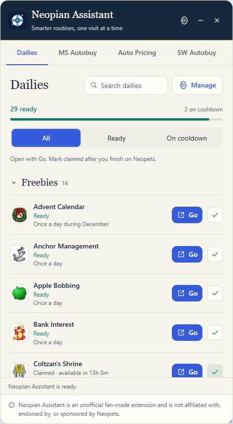
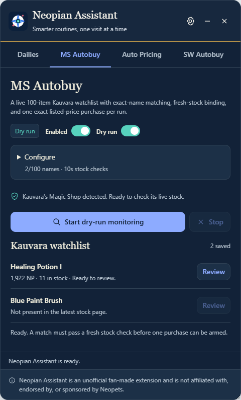
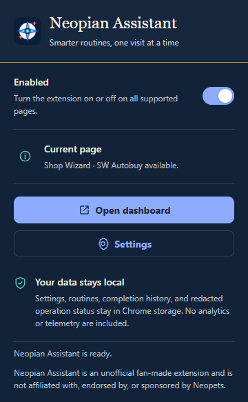
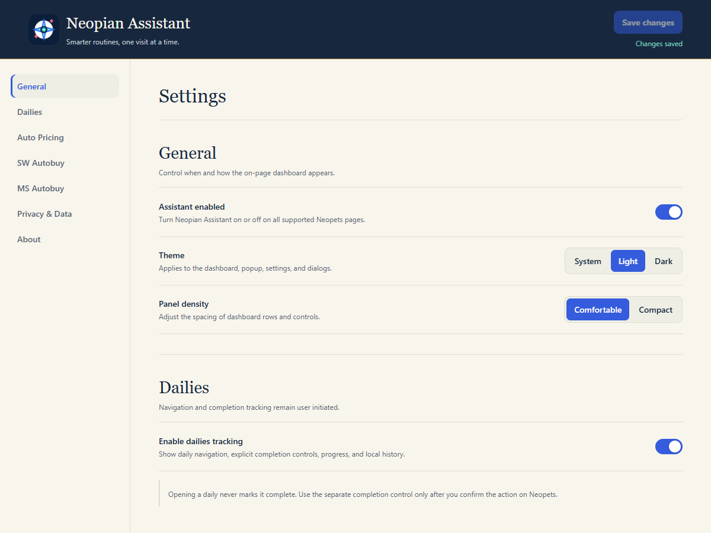
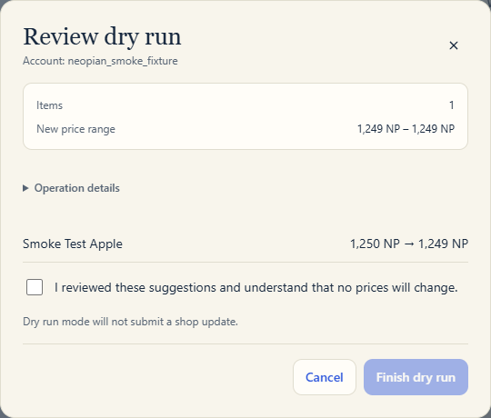

<p align="center">
  
</p>

<h1 align="center">Neopian Assistant</h1>

<p align="center">
  <strong>Smarter routines, one visit at a time.</strong><br>
  A thoughtfully designed companion for your Neopets day.
</p>

<p align="center">
  <a href="https://github.com/jtaitt-dev/Neopian-Assistant/actions/workflows/ci.yml"></a>
  
  
</p>

<p align="center">
  <a href="#get-started">Get started</a> ·
  <a href="docs/USER_GUIDE.md">User guide</a> ·
  <a href="CHANGELOG.md">What's new</a> ·
  <a href="PRIVACY.md">Privacy</a>
</p>

Keep your dailies organized, compare shop prices, and follow the items you're watching from one
movable dashboard. Neopian Assistant brings clear availability, deliberate review steps, and
consistent controls to the pages where you already play.

> Neopian Assistant is an unofficial fan-made extension and is not affiliated with, endorsed by, or
> sponsored by Neopets.

## Your companion, at a glance

<table>
  <tr>
    <td align="center" width="50%">
      
      <br><strong>A clear start to your day</strong><br>
      Ready routines, useful notes, and calm ivory surfaces.
    </td>
    <td align="center" width="50%">
      
      <br><strong>Focus when it matters</strong><br>
      Readable watchlists and explicit states in deep navy.
    </td>
  </tr>
</table>

_Actual 7.14.0 extension screenshots using synthetic fixture data. No real account or transaction
data is shown._

## Four tools, one familiar workspace

| Tool             | What it helps you do                                                                                                                                                                 | Where to use it                                                                    |
| ---------------- | ------------------------------------------------------------------------------------------------------------------------------------------------------------------------------------ | ---------------------------------------------------------------------------------- |
| **Dailies**      | Search your routines, filter by availability, organize groups, and track cooldowns. Opening a page and marking a claim are separate actions.                                         | Supported Neopets pages                                                            |
| **Auto Pricing** | Scan Shop Wizard prices, compare current and suggested prices, select changes, and review the exact plan before an update.                                                           | [Your shop stock](https://www.neopets.com/market.phtml?type=your)                  |
| **MS Autobuy**   | Monitor up to **100 exact item names** at Kauvara's Magic Shop. Dry runs review one listing; live mode requires the official human verification before one exact listed-price offer. | [Kauvara's Magic Shop](https://www.neopets.com/objects.phtml?type=shop&obj_type=2) |
| **SW Autobuy**   | Follow up to **10 exact item names**, inspect matched listings, and review one item against your configured price ceiling.                                                           | [Shop Wizard](https://www.neopets.com/market.phtml?type=wizard)                    |

All shop tools begin in **dry-run mode**. MS Autobuy and SW Autobuy are disabled by default. MS
Autobuy uses the exact listed price and has no user-configured price ceiling; SW Autobuy uses your
maximum purchase price. See the [workflow guide](docs/USER_GUIDE.md#feature-guide) for their
distinct limits, review requirements, and verification steps.

## Designed to feel at home

- **One visual language.** Warm ivory, deep navy, serif headings, the original compass, and crisp
  cobalt actions carry through the dashboard, popup, settings, and dialogs.
- **A panel that fits your space.** New installations start at 480px. Drag, resize, minimize, or
  close it; saved widths are preserved and the panel stays within the viewport.
- **Less searching, more clarity.** Ready and cooldown counts sit above the daily list. Search and
  availability filters work together, and countdown updates preserve focus and scroll position.
- **Details when you need them.** Shop mode, enablement, availability, and the primary action stay
  visible. Configure opens automatically when essential setup is missing.
- **Settings with a clear outcome.** Active-section navigation and a persistent Save changes action
  show unsaved, saving, saved, and failed states. Failed saves retain your edits for retry.
- **Comfortable to navigate.** Light, dark, and system themes; comfortable and compact density;
  visible keyboard focus; dialog focus restoration; and reduced-motion support.

Use the arrow keys, Home, or End to move focus across dashboard tabs. Press Enter or Space to
activate the focused tab. Tab moves through the controls within a tool.

<details>
<summary><strong>Explore the popup, settings, and review experience</strong></summary>

### Context at a glance

<p align="center">
  
</p>

The popup shows the current page and available feature, with a contextual action to open or focus
your dashboard.

### Preferences that stay clear



### Review before a change

<p align="center">
  
</p>

Pricing reviews keep the selected changes and required acknowledgement together. A dry run never
submits a shop update.

</details>

## Get started

**Requires Chrome 114 or later.** The extension runs on `https://www.neopets.com/*`.

1. Download a ZIP from [GitHub Releases](https://github.com/jtaitt-dev/Neopian-Assistant/releases)
   and extract it to a permanent folder. To use the current source version before its release
   package is published, follow [Build from source](#build-from-source).
2. Open `chrome://extensions/` and turn on **Developer mode**.
3. Select **Load unpacked** and choose the extracted folder containing `manifest.json`.
4. Reload an open Neopets page and use the toolbar popup to **Open dashboard**.
5. Open **Settings** to choose your theme and density. Start with dailies and dry runs before
   enabling any authorized live shop workflow.

The ZIP is an unpacked extension package, not a signed Chrome Web Store installation. The current
source and generated package version is **7.14.0**.

### Build from source

Use Node.js **20.9 or later** and npm. CI uses Node.js 22.

```sh
git clone https://github.com/jtaitt-dev/Neopian-Assistant.git
cd Neopian-Assistant
npm ci
npm run verify
npm run package
```

Load `dist/` in Chrome, or extract `release/neopian-assistant-7.14.0.zip` and load that folder.
After changing source, rebuild, reload the extension in `chrome://extensions/`, then reload the
Neopets page. Use `npm run dev` for automatic rebuilds during development.

## Deliberate by design

Shop lookups are paced, sequential, and cancellable. Consequential operations validate fresh state,
bind authorization to the exact reviewed action, prevent duplicate submissions across tabs, submit
once, and verify the result. Ambiguous outcomes are marked **uncertain** and require manual
inspection before further action.

MS Autobuy leaves Neopets' official verification to the user. SW Autobuy monitoring never purchases
on its own. Daily navigation never implies that a reward was claimed.

Neopets automation is policy-sensitive. The repository owner's stated project-specific approval for
Auto Pricing and official daily images does not grant general permission to users or forks. Enable
live shop workflows only with applicable authorization. Read the
[full workflow and policy guidance](docs/USER_GUIDE.md#known-limitations-and-policy-risk).

## Your data stays local

Settings, routines, cooldowns, watchlists, and redacted operation records stay in Chrome extension
storage. There is no analytics, telemetry, or developer-operated backend. Requests used by shop
tools go only to fixed Neopets endpoints.

The extension declares `storage` and access to `https://www.neopets.com/*`. It does not read cookie
values or passwords. Official daily images load from `images.neopets.com` under the repository
owner's stated project-specific approval.

Export, import, or clear extension data from **Settings → Privacy & Data**.
[Read the privacy policy](PRIVACY.md) for the complete data-flow and retention details.

## Documentation and development

| Resource                               | What you'll find                                                                              |
| -------------------------------------- | --------------------------------------------------------------------------------------------- |
| [User guide](docs/USER_GUIDE.md)       | Tool workflows, limits, installation, troubleshooting, architecture, and release instructions |
| [Changelog](CHANGELOG.md)              | What's changed in each version                                                                |
| [Test evidence](docs/TEST_EVIDENCE.md) | Behavioral checks, fixture-based browser validation, and release verification                 |
| [Contributing](CONTRIBUTING.md)        | Branch naming, development workflow, and review requirements                                  |
| [Security](SECURITY.md)                | Private reporting guidance                                                                    |
| [Privacy](PRIVACY.md)                  | Permissions, storage, and network data flows                                                  |

The extension uses Manifest V3, vanilla JavaScript, HTML, and CSS. Shared appearance tokens keep the
injected dashboard and extension pages consistent; injected styles are scoped to extension elements.

```sh
npm run dev           # Watch and rebuild
npm test              # Behavioral and integration tests
npm run verify        # Format, lint, tests, build, manifest, icons, and secrets
npm audit --audit-level=high
npm run package       # Deterministic release ZIP
```

The 7.14.0 redesign was checked across all four tools, both themes, both densities, and
340/480/640px panel widths, with short-viewport, keyboard, focus, failure, and uncertain-state
checks. Browser testing used synthetic fixtures and dry runs; no real account transaction was
performed. See [test evidence](docs/TEST_EVIDENCE.md) for the results and limitations.

## License and attribution

The compass is original extension artwork. Official daily images remain subject to their owners'
rights and the stated project-specific approval.

No software license has been selected. The package is marked `UNLICENSED`; all rights are reserved
unless the repository owner adds an explicit license.

Neopian Assistant is an unofficial fan-made extension and is not affiliated with, endorsed by, or
sponsored by Neopets.
