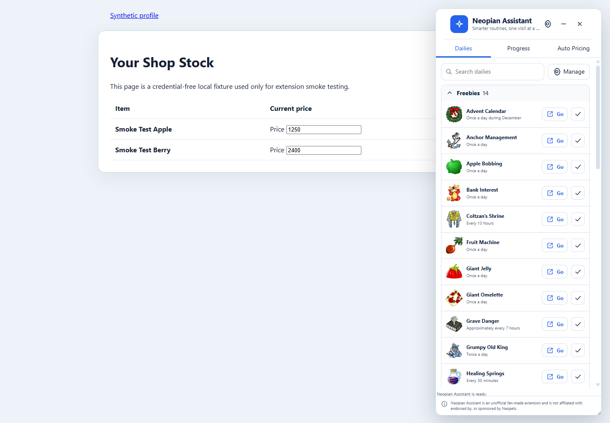
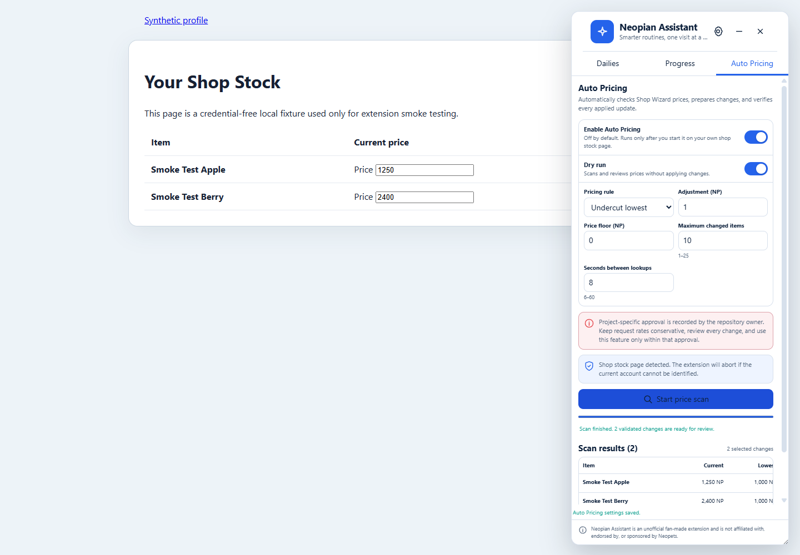
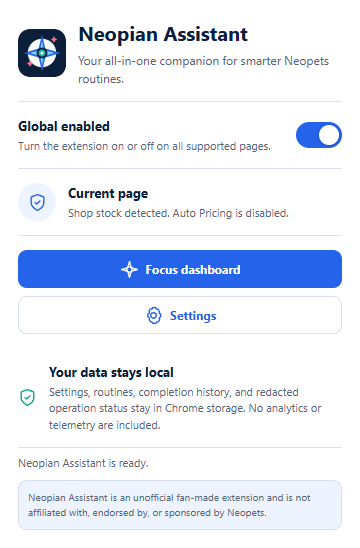
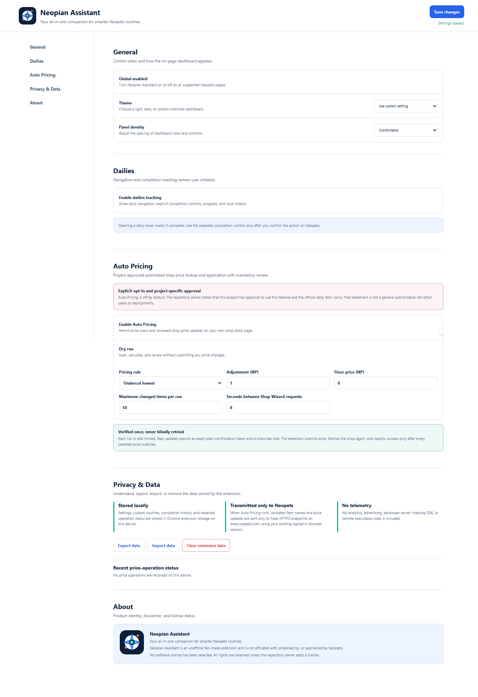

# Validation and Browser Evidence

Evidence date: 2026-07-18

Build: Neopian Assistant 7.8.0 (`dist/`) Browser: Chrome for Testing 151 with a disposable,
credential-free profile

## Automated validation

`npm run verify` passed:

- Prettier format verification.
- Biome lint with no warnings.
- 28 Node behavioral tests, 28 passed, 0 failed, 0 skipped.
- esbuild production build.
- Manifest V3, file reference, icon dimension/alpha, CSP-safe HTML, branding/version, unsafe API,
  and production surface validation.
- Repository secret scan with no credential-shaped values, sensitive filenames, or private local
  paths.

## Clean-profile browser matrix

| Scenario                        | Evidence/result                                                                                                                                                                      |
| ------------------------------- | ------------------------------------------------------------------------------------------------------------------------------------------------------------------------------------ |
| Install/manifest/service worker | Unpacked `dist/` loaded; `background.js` registered as the module service worker.                                                                                                    |
| Dashboard/intended origin       | One dashboard injected on a synthetic HTTPS `www.neopets.com` shop page.                                                                                                             |
| Unintended origin               | Synthetic `https://example.com/unmatched` had zero dashboard shells.                                                                                                                 |
| Reload/idempotency              | Reload retained exactly one shell.                                                                                                                                                   |
| Multiple tabs                   | Two matched tabs each had one shell; unmatched tab had none.                                                                                                                         |
| Official item icons             | 31/31 production item icons loaded from `https://images.neopets.com/items/`; sampled assets had an 80 px natural width.                                                              |
| Popup/options                   | Both extension pages loaded with correct branding, exact tagline/disclaimer, privacy copy, and no console errors.                                                                    |
| Settings persistence            | Auto Pricing remained enabled in Chrome local storage and after a full browser close/reopen.                                                                                         |
| Shared-state race regression    | Auto Pricing stayed on the selected tab, the Start control enabled, and service-worker storage agreed with the UI.                                                                   |
| Approved Auto Pricing dry run   | Two synthetic shop rows received mocked Wizard prices. Both suggestions were reviewable; confirmation showed the synthetic account, two items, price range, and a UUID operation ID. |
| No real update                  | Dry-run completion reported: “Dry run complete for 2 changes. No prices were submitted.”                                                                                             |
| HTTP failure                    | Mocked HTTP 503 produced two error rows, a clear failure status, and no review button.                                                                                               |
| Offline                         | With network state offline, the packaged popup still opened and rendered from local extension assets.                                                                                |
| Keyboard/focus                  | Tab navigation reached **Save changes** and computed a solid visible focus outline.                                                                                                  |
| Console                         | Zero errors and zero warnings across the final dashboard, popup, options, successful dry run, failure state, reload, and multi-tab checks.                                           |

No live Neopets account was used. No real lookup credentials, purchase, offer, inventory action, or
shop update was performed. The fixture account and items are synthetic. The only live evidence
requests were public, owner-approved official item images.

## Visual comparison to design concepts

The implementation follows the concepts in:

- `docs/design/dashboard-dailies-concept.png`
- `docs/design/dashboard-auto-pricing-concept.png`
- `docs/design/popup-options-concept.png`

Comparison outcomes:

1. The hierarchy matches: original brand mark/header, Dailies/Progress/Auto Pricing tabs, prominent
   primary action, bounded panels, status region, and persistent disclaimer.
2. The palette matches the intended navy/blue/teal foundation with coral warning/error treatment,
   light surfaces, subtle borders, and dark/system theme support.
3. Auto Pricing retains the concept's opt-in toggle, dry-run toggle, bounded rule controls,
   conservative interval, page/account requirement, progress/cancellation, results table, review
   step, operation ID, and verification language.
4. Popup and options preserve the concept's fast global toggle, current-page state, local-data
   explanation, settings navigation, pricing disclosure, privacy controls, and About/license
   section.
5. Production density is intentionally more compact than the high-fidelity concepts so the dashboard
   remains usable at a 390 px default width and the popup fits Chrome's action surface.

One intentional change follows the owner's later approval: the concept used abstract daily markers,
while production uses official Neopets item icons from the restricted `images.neopets.com/items/`
origin. Neopian Assistant's own compass-spark logo remains original and does not use an official
Neopets logo or copied game branding.

## Screenshots

